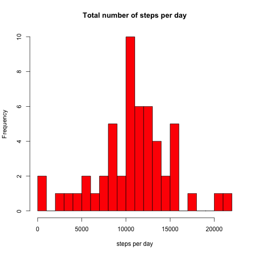
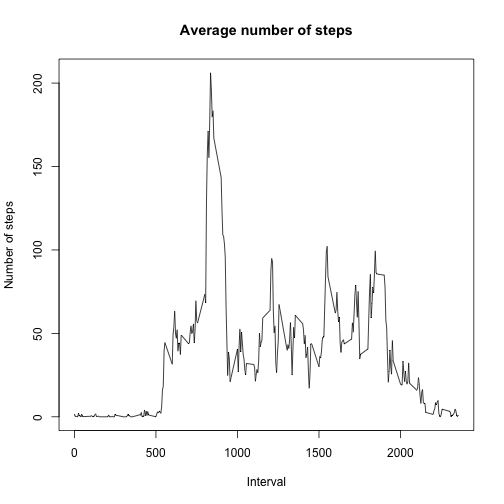
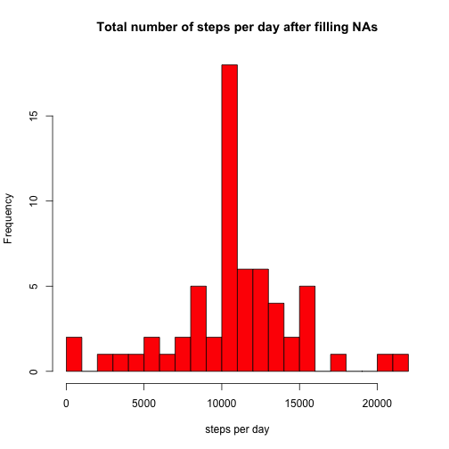
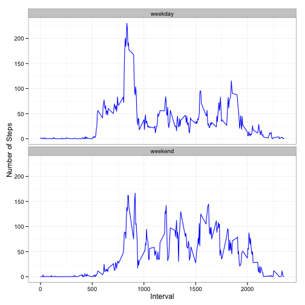

Reproducible Research. Assignment nr. 1
========================================================

This is an R Markdown document describing all the steps required for the first assignment of the Coursera Reproducible Research course.


## Loading and preprocessing the data
First set working directory to source file location. 
Here the file *repdata_dat_activity.zip* has been already unzipped to produce *activity.csv*. 

```r
dat <- read.csv("activity.csv")
head(dat)
```

```
##   steps       date interval
## 1    NA 2012-10-01        0
## 2    NA 2012-10-01        5
## 3    NA 2012-10-01       10
## 4    NA 2012-10-01       15
## 5    NA 2012-10-01       20
## 6    NA 2012-10-01       25
```

```r
dat$date <- as.Date(dat$date, "%Y-%m-%d")
dim(dat)
```

```
## [1] 17568     3
```
Load the data, set the date format and check the number of entries. There should be a total of 17,568 observations in this dataset and this is the case.

## What is the mean total number of steps taken per day?

Ignoring the missing values in dat$steps for now.
1. Make a histogram of the total number of steps taken each day


```r
dat2 <- aggregate(steps ~ date, data=dat, FUN=sum)
barplot(dat2$steps, main="Total number of steps per day",xlab="date", ylab="nr steps", names.arg=dat2$date, col="2")
```

 

2. Calculate and report the *mean* and *median* total number of
   steps taken per day


```r
mean(dat2$steps)
```

```
## [1] 10766.19
```

```r
median(dat2$steps)
```

```
## [1] 10765
```

## What is the average daily activity pattern?

1.Make a time series plot (i.e. `type = "l"`) of the 5-minute
   interval (x-axis) and the average number of steps taken, averaged
   across all days (y-axis)


```r
dat3 <- aggregate(steps ~ interval, dat, mean, na.rm = TRUE)
plot(dat3, type = "l" , xlab = "Interval", ylab = "Number of steps", main ="Average number of steps")
```

 

2.Which 5-minute interval, on average across all the days in the
   dataset, contains the maximum number of steps?


```r
dat3[which.max(dat3[,2]),1]
```

```
## [1] 835
```


## Imputing missing values

1.Calculate and report the total number of missing values in the dataset (i.e. the total number of rows with `NA`s)


```r
sum(is.na(dat))
```

```
## [1] 2304
```

2.Devise a strategy for filling in all of the missing values in the dataset. The strategy does not need to be sophisticated. For example you could use the mean/median for that day, or the mean for that 5-minute interval, etc.

My choice here is the following: fill the missing values by *mean value for the corresponding 5-minute interval*

3.Create a new dataset that is equal to the original dataset but with the missing data filled in. The new dataset is called *filled_dat*


```r
temp <- merge(dat, dat3, by="interval", suffixes=c("",".y"))
temp$steps<-ifelse(is.na(temp$steps),temp$steps.y,temp$steps)
filled_dat <- temp[,c(1:3)]
sum(is.na(filled_dat))
```

```
## [1] 0
```

4.Make a histogram of the total number of steps taken each day and
   Calculate and report the **mean** and **median** total number of
   steps taken per day. Do these values differ from the estimates from
   the first part of the assignment? What is the impact of imputing
   missing data on the estimates of the total daily number of steps?


```r
filled2 <- aggregate(steps ~ date, data=filled_dat, FUN=sum)
barplot(filled2$steps, main="Total number of steps per day after filling NAs", xlab="date", ylab="nr steps", names.arg=filled2$date, col ="2")
```

 

```r
mean(filled2$steps)
```

```
## [1] 10766.19
```

```r
median(filled2$steps)
```

```
## [1] 10766.19
```

The impact of the missing data is completely negligible.


## Are there differences in activity patterns between weekdays and weekends?

1.Create a new factor variable in the dataset with two levels --
   "weekday" and "weekend" indicating whether a given date is a
   weekday or weekend day.


```r
daytype <- as.factor(ifelse(weekdays(filled_dat$date)%in% c("Saturday", "Sunday"), "weekend","weekday"))
filled_dat <- cbind(filled_dat,daytype)
```

2.Make a panel plot containing a time series plot (i.e. `type = "l"`)
   of the 5-minute interval (x-axis) and the average number of steps
   taken, averaged across all weekday days or weekend days
   (y-axis).


```r
library(ggplot2)
dat4 <- aggregate(steps ~ interval + daytype, filled_dat, mean)
ggplot(dat4, aes(x=interval,y=steps)) + geom_line(color="4",size=0.5) +  facet_wrap(~daytype, nrow=2, ncol=1) + labs(x="Interval",y="Number of Steps") + theme_bw()
```

 

The two plots are qualitatively different. The maximum value during weekdays is higher than over weekends.

